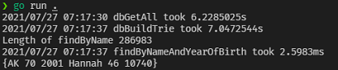
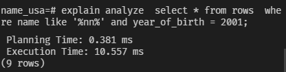

# Optimize "USA Birth Name Database" with Trie

## About
  Inspired by Hussein Nasser's video, I created my first mini-project in Go to optimize regex-like query with 
  Postgresql and [go-pq](https://github.com/go-pg/pg) package.
  
## Performance
  * With the use of Trie on `name` field, I achieved faster performance of 2.5 ms:
 
      

  * Compares to 10 ms query from database (Indexes created)
  
      

  
  
## Misc

* Checkout the video [Database Indexing Explained (with PostgreSQL)](https://www.youtube.com/watch?v=-qNSXK7s7_w) - 
    and his channel [Hussein Nasser](https://www.youtube.com/c/HusseinNasser-software-engineering)

* Checkout project's diary at [doc.txt](./doc.txt)
