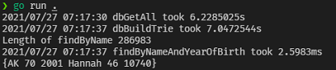

# Optimize "Naming in the USA Database" with Trie

## About
  Inspired by Hussein Nasser's video, I created my first mini-project in Go to optimzie regex-like query. 
  With the use of Trie, I achieved 4X performance of 2.5 ms compares to 10 ms.
  Checkout project's diary at [doc.txt](./doc.txt)
  

